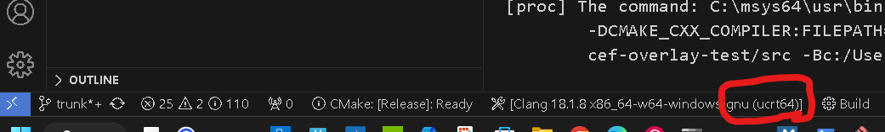

# cef-overlay-test

A test-prototype to get (and understand) Linux, WIndows, and MacOS to render invisible (frameless) CEF via CMake for cross-compilations

- [CEF repository](https://bitbucket.org/chromiumembedded/cef/src/master/)
- Unsure what LICENSE CEF is (their LICENSE.txt was a bit to concise) so making this MIT LICENSE
- Because the github version seems to be Linux biased (I'm not 100% sure, but their Python script even does `lsb_release` which is hard to fake (i.e. write my own `lsb_release.sh` for Windows and MacOS)) so we'll be using the [SpotifyCDN](https://cef-builds.spotifycdn.com/index.html) version which you can download post-compiled binaries for [MacOS ARM64](https://cef-builds.spotifycdn.com/index.html#macosarm64) (and Windows x86_64) to save time compiling them.  All you need are the "Standard" binary for each (target) platform.
- C++ Documentations at [Chromium Embedded Framework (CEF) Documentation](https://cef-builds.spotifycdn.com/docs/129.0/index.html) - at the time of the writing, it was/is at build '129.0.1+g463bda9+chromium-129.0.6668.12'
- [CEF Forum](https://magpcss.org/ceforum/index.php)
-
- [CefBrowserHost::CreateBrowser](https://cef-builds.spotifycdn.com/docs/106.1/classCefBrowserHost.html#:~:text=Create%20a%20new%20browser%20using%20the%20window%20parameters)

## Goals

To lean and test-compile (and run) CEF (basically starting off with cefsample and cef-client) in frameless and titleless with simple "Hello World" as overlay on Linux, Windows, and MacOS.

## Technical Issues

- Turns out I have to `clang++`  (`g++`) using C++ 17 (via `-std=c++17`) so that compiling (and linking) will succeed
- For both Linux and Windows, because the GUI (GTK and WinForm respectively) are based on C/C++ library, there are no bridge/proxy from C++ to platform-native GUI libraries
  - For MacOS on the other hand, the platform-native GUI is based on Objective-C libraries, in which you'd have to have Objective-C compiler reference (`static`) function-methods in C++ and link it.  If you've ever done any InterOp'ing in C# (actually, .NET) to native C++, or have tried to access GTK3 and/or WinForm from Rust in which you had to run `bindgen` to create wrapper methods of C/C++ libraries to Rust, you're already familiar with this practice.
- I am using `cmake` (`CMakeLists.txt`) to support cross-compile and multiple-platform, and have used [this as base](https://stackoverflow.com/questions/20962869/cmakelists-txt-for-an-objective-c-project) starting point.
  - I am not using XCode project (it's based on mixing CPP and OBJCXX)

## Setup and Install

First, head down ([below](#build prerequisite)) to install all the prerequisite of buildutils and build-chaintools.

Once all is in place, you should just be able to run:

```bash
$ ./build.sh
```

The script should work on MinGW (Windows), Linux, and macOS (all verified).  It will first download (if not present) the CEF binaries for compiling  (header files) and linking (lib files) for Release build-target.

The script will try to precheck for the CLI tools, and if the script complains, locate the missing packages in prerequisite below and try again.  As long as you do not change the `CMakeFiles.txt` (and the `.in` include templates) files, there should be no need to delete the `build.<platform>` directory.

Final binaries whould reside in the `build.<platform>` (where platform are Linux, win.mingw, or mac).  You can also do `find -type f -perm -111` (on mac) or `find -type f -executable` (on Linux and MinGW) to find the executable files generated.

### Build Prerequisite

Due to not knowing what platform you're on, as well as unaware whether you're using `apt` (Debian hybrids - Linux), `pacman` (Arch, SuSE, MSys64/MinGW - Windows), or even `brew` (MacOS), you'll have to manually install it yourself.  What you need are the following:
Here are lists of packages you need to preinstall (on Linux, Windows MSYSTEM=UCRT64, and macOS):

- [vcpkg](https://learn.microsoft.com/en-us/vcpkg/get_started/get-started?pivots=shell-bash) - note that on macOS (unlike Linux and MinGW), the app installation is at `VCPKG_ROOT=/your/github/cloned/dir` (basically, `bootstrap-vcpkg.sh` that you'd run on macOS will just copy it on that directory, commonly on both Linux and MinGW, it's in `VCPKG_ROOT=/opt/vcpkg` dir)
- `clang` and `llvm` so that `g++` is generic on all platform - note that you'll have about 3 choices on Windows, chose UCRT64 (not MSYS, CLANG64, or MINGW64).  What is most important is that you make sure to install the version that supports C++17 because of MacOS GUI (Cocoa relies heavily on C++ `templates` defined in C++17 and above)
- Other CLI tools that may need to be installed:
  - `bash` - I don't wish to write 2 scripts, one for `bash` and one for `zsh`, so on MacOS, you'll have to install `bash` yourself (I use commands such as `uname -a`, `source`, `-e ||`, etc)
  - `tar` - to untar binaries from spotifycdn
  - `wget` - if you prefer `cURL`, you'll have to modify `build.sh` manually/yourself; (some distros on Linux comes with cURL but not wget)
  - tar
- `cmake` and `ninja` - again, for portable.  Optionally you can install `GNU make` but I will yield towards `ninja`; one frustrating gotcha I've encounted on MinGW (not on Linux and/or macOS) is that you have to explicitly tell CMake via `CC` and `CXX` environment veriable to reference `/c/msys64/mingw64/bin/clang++.exe` (with the ".exe") or else it won't create `ninja.build` file!
  - Note that for Windows, you have to install the `ucrt` version of cmake (i.e. `mingw-w64-ucrt-x86_64-cmake`)
- XCode (for macOS only) - you'll need the whole SDK'ish (I don't know what to call it, I'm still learning) package so that you can have Objective-C++ to consume/link the C++

### Windows: MSYS2 (MinGW)

Note that for the sake of not wanting to install toolchains that are not bash/zsh compatible, AND the fact that Microsoft requires license (paid) if the compiled applications are for commercial use, hence you cannot install Microsoft Community and assume you can compile things for free!

For C/C++ development, MinGW comes with 4 flavors of binary output (of which, 3 uses `gcc` and one uses `llvm`).  The following are the Environment Variable you would set for [MSYSTEM](https://www.msys2.org/docs/environments/#__tabbed_1_1):

- MSYS
- UCRT64
- CLANG64
- MINGW64

This author prefers MSYSTEM=MINGW64 mainly because you can cross-compile inside Linux with for Windows output!  Unfortunately, the CEF binary are build using MSVC (it makes no sense to me since CEF maintainers assumes that you'll be linking using MSVC, which means commercial usage).

The UCRT in the new "universal" (standard) C Run-Time which Microsoft newer Visual Studios uses to compile.  Fortunately, MSYS2 offers toolchains to compile and link against non-legacy MSVC built libraries.  Non-legacy, meaning the older MSVCRT (Microsoft C Run-Time) built libraries (usually, that's only 32-bits) will not link.

Long story short, this author spent (wasted) more than 1/2 day scratching my head figuring out why CEF (`libcef.lib`) library on Windows will not link!

You'll first need to make sure one way or another, set your environment variable:

```bash
$export MSYSTEM=UCRT64
```

Though this author's bash script will set it in multiple places, it is mentioned here because when you are pulling in the libraries and compiler/build toolchains, you'be be offered 4 choices when you do `pacman -Ss <dev-package>` like so:

```bash
$ pacman --search --sync "7zip"
clangarm64/mingw-w64-clang-aarch64-7zip 24.08-1
    A file archiver with a high compression ratio (mingw-w64)
mingw64/mingw-w64-x86_64-7zip 24.08-1
    A file archiver with a high compression ratio (mingw-w64)
ucrt64/mingw-w64-ucrt-x86_64-7zip 24.08-1
    A file archiver with a high compression ratio (mingw-w64)
clang64/mingw-w64-clang-x86_64-7zip 24.08-1
    A file archiver with a high compression ratio (mingw-w64)
msys/p7zip 17.05-2 (compression)
    Command-line version of the 7zip compressed file archiver
    
$ pacman --search --sync "cbindgen"
clangarm64/mingw-w64-clang-aarch64-cbindgen 0.27.0-1
    A project for generating C bindings from Rust code (mingw-w64)
ucrt64/mingw-w64-ucrt-x86_64-cbindgen 0.27.0-1
    A project for generating C bindings from Rust code (mingw-w64)
clang64/mingw-w64-clang-x86_64-cbindgen 0.27.0-1
    A project for generating C bindings from Rust code (mingw-w64)
```

This author used "7zip" as an example just to mention that the `msys` is not really a dev library to link against, it's actually a system application.  As a separate example, this author used Rust's "cbindgen" to show that there are 3 targets you can choose from.  Of the 3, it is most likely the case that you do not need to bother with `arm64` henc your choices are either `ucrt` or `clang`.  As mentioned above, for CEF to link properly, at least for this project, you must choose `ucrt` for your Windows target binary.

Lastly, you want to make sure VSCode can find your Universal CRT compiler (`clang` and `clang++`) rather than the MinGW64 version:



### `bash` and other Unix/Linux CLI commands

One issue about this project is that (as mentioned above), I am *VERY* `bash` (Linux CLI command) biased.  You *MUST* make sure one way or another, for even VSCode to be able to access `bash` because you will see logics even in `CMakeLists.txt` (`cmake`) build logic like this:

```cmake
# Check if the C and C++ compilers are set in the environment variables
if(DEFINED ENV{CC})
    set(CMAKE_C_COMPILER $ENV{CC})
else()
    execute_process(COMMAND which clang OUTPUT_VARIABLE CLANG_PATH OUTPUT_STRIP_TRAILING_WHITESPACE)
    if(CLANG_PATH)
        set(CMAKE_C_COMPILER ${CLANG_PATH})
        message(WARNING "CC environment variable is not set, defaulting to clang at ${CLANG_PATH}")
    else()
        message(FATAL_ERROR "CC environment variable is not set and clang not found in PATH")
    endif()
endif()

if(DEFINED ENV{CXX})
    set(CMAKE_CXX_COMPILER $ENV{CXX})
else()
    execute_process(COMMAND which clang++ OUTPUT_VARIABLE CLANGXX_PATH OUTPUT_STRIP_TRAILING_WHITESPACE)
    if(CLANGXX_PATH)
        set(CMAKE_CXX_COMPILER ${CLANGXX_PATH})
        message(WARNING "CXX environment variable is not set, defaulting to clang++ at ${CLANGXX_PATH}")
    else()
        message(FATAL_ERROR "CXX environment variable is not set and clang++ not found in PATH")
    endif()
endif()
```

This IMHO is better than hard-coding paths depending on different OS.  By doing `which clang++` (or `which g++`) to get clang and clang++ paths (i.e. `/usr/bin/g++`, `/c/msys/mingw64/usr/bin/g++`, `/mingw64/bin/clang`, etc) dynamically, we do not have to hard code the paths.  Even just testing on Linux, not all distros will place `gcc` in same directory (i.e. `/bin/gcc`, `/usr/bin/gcc`, `$HOME/bin/gcc`, `/opt/bin/gcc`, etc).  Screw that, just do `export CXX="$(which clang++)"` during build-time and dynamically determine it...

### Building

Use `build.sh`; I try to `echo` warnings/errors in the shell script when I cannot find `wget` or other CLI packages that is possibly optional on MacOS, as well as listing ahead on the [Prerequisite](#prerequisite) above, but there may be times where I've preinstalled it and have forgotten about it.
